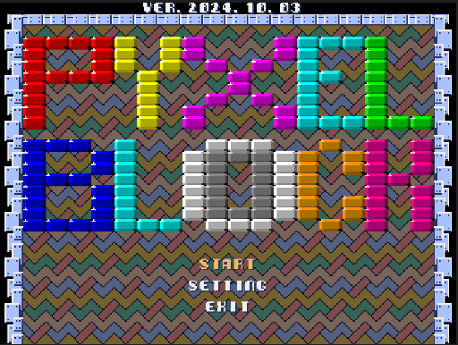

# Pyxel Block

## 概要
- ゲーム内容はブロック崩し（Breaking blocks）。
- 画面モードは、320x240と240x240があります。
- 効果音は、frenchbreadさん作成の「Pyxel RPG SE パック」を使用しています。
- マウス操作のみ（mouse control only）
- 16色を超える色対応

## GIFアニメ

## Goto Pyxel Contents
[Pyxel Contents](https://sanbunno-ichi.github.io/PyxelContents/)

## 更新履歴
2024.10.03 version 2.0 Update  
更新内容：  
・アイテム追加  
・CONTINUE追加  
・三発で壊れるブロック追加  
・面エディタ追加（作成データはコンソール出力する）  
・ステージ追加  
2024.09.20 data_ptrによる高速化、Exit機能追加  
2024.09.17 更新  
2024.09.15 新規追加  

