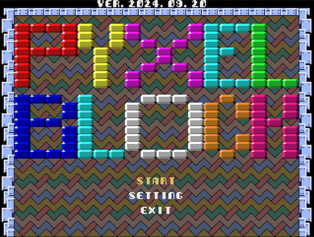
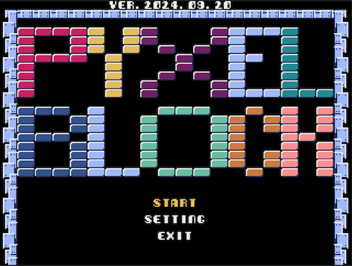
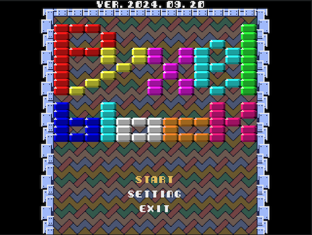
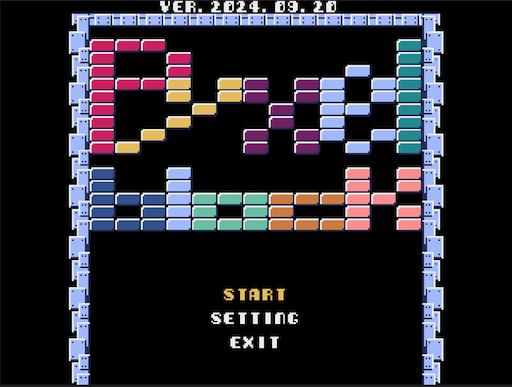
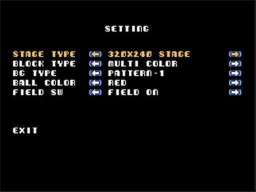

# Pyxel Block

## 概要
- ゲーム内容はブロック崩し（Breaking blocks）。
- 画面モードは、320x240と240x240があります。
- 効果音は、frenchbreadさん作成の「Pyxel RPG SE パック」を使用しています。

- マウス操作のみ（mouse control only）
- 16色を超える色対応

## スクリーンショット
 
 
 
 
 

## GIFアニメ

## 動作確認
- [URL](https://sanbunnoichi.web.fc2.com/pyxel/pyxelblk.html)

## 更新履歴
2024.09.17 更新  
2024.09.15 新規追加  

